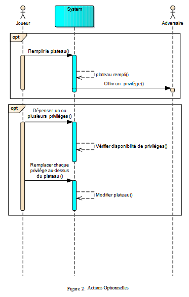

# Splendor Duel
Une adaptation du jeu de société à deux joueurs éponyme. Ce projet permet à deux joueurs de s'affronter ou bien à un joueur d'affronter une Intelligence Artificielle par le biais d'une interface graphique ou d'une interface graphique (plus aboutie).  
Ceci est un projet étudiant, réalisé un temps contraint et limité et dont le développement est aujourd'hui stoppé.

## Création
27/09/2023

## Dernière modification
24/12/2023

## Auteurs
- Simon Biffe  
Développeur du Back-end, responsable de la gestion des jetons et de l'Intelligence Artificielle  
Reponsable et développeur de l'Interface console  
Responsable des fusions Git  
- Marie-Herminie Blondy  
Développeur du Back-end, responsable de la gestion des cartes Joaillerie  
Reponsable et développeur de l'Interface console  
Responsable du planning  
- Ismail Essagar  
Responsable et développeur de l'interface graphique (Qt)  
- Ahmed Bouzidi  
Développeur de l'interface graphique

## Architecture

### Gestion des structures de données par la classe Partie

La classe Partie joue le rôle d’intermédiaire entre l’interface, qu’elle soit console ou graphique, et les structures de données de la partie. Chacune des actions optionnelles et obligatoires (utilisation de privilège, remplissage du plateau, prise de jeton(s), achat de carte Joaillerie et réservation de carte Joaillerie) est ainsi déléguée à Partie qui utilise pour cela les méthodes appropriées dans chacune des classes Plateau, Sac, Pyramide, Joueur, CarteRoyale et CarteJoaillerie.
Le design pattern Singleton a été utilisé pour ne permettre qu’une unique instance de la classe Partie par partie. De même pour les classes Plateau, Sac et Pyramide qui ne devraient pas être dupliquées.  

Elle contrôle le cycle de vie des objets qui la compose, notamment Pyramide qui est elle-même un Singleton. InterfaceConsole gère Partie, nous avons dû être attentifs à l'ordre dans lequel ces objets étaient créés et la mémoire allouée (voir sauvegarde).

### Gestion des jetons

Imaginé comme un moyen de stockage des jetons pour différentes classes, en particulier Sac, Joueur et CarteJoaillerie, le rôle de StockGemmes a été élargi pour lui permettre de devenir aussi un moyen d’échange entre les différentes classes. C’est pourquoi les opérateur +, - et = de la classe ont été surchargés, permettant ainsi lors d’un retrait de jetons du plateau de simplement additionner un StockGemmes au stock de jetons du joueur, ou encore de ne faire qu’une soustraction lors de l’achat d’une carte. Il est à noter que l’opérateur - vérifie que qu’aucun des champs renvoyés n’est négatif, levant donc directement une exception gérable si on tente d’acheter une carte trop chère.  
La classe StockGemmes a aussi été dotée d’une fonction externe, car ne nécessitant pas d’accès aux attributs ou méthodes privés, total_stock, renvoyant le nombre total de jetons stockés, dans le but de vérifier à la fin de chaque tour si le nombre de jetons de chaque joueur ne dépasse pas 10.  
Enfin, afin de gérer l’or facilement sans pour autant imposer la présence de ce champ dans des des classes qui ne devraient pas en gérer, le choix a été fait de créer une nouvelle classe StockGemmesOr héritant de StockGemmes. Les opérateurs +, - et = sont redéfinis afin de prendre en compte l’or, en particulier pour l’opérateur de soustraction qui compense maintenant si possible les valeurs négatives de chaque type de jeton avec l’or disponible avant de lever une exception comme précédemment.
A noter qu’une vérification que la quantité de jetons de chaque type du stock ne dépassait pas la quantité maximum du jeu (4 pour toutes les couleurs exceptées les perles) a d’abord été implémentée, avant d’être abandonnée puisqu’aucune classe ne pouvait alors utiliser StockGemmes. En effet, le coût des cartes peut dépasser cette valeur et toutes les autres classes concernées doivent gérer de l’or, suggérant alors l’utilisation de StockGemmesOr , non concernée par cette vérification puisque destinée initialement au stockage des bonus de jetons des cartes.  

Divers opérateurs ont depuis été ajoutés à StockGemmes et StockGemmesOr pour optimiser la gestion des jetons dans les différentes classes et notamment lors de l’achat de cartes Joaillerie et de la recherche de carte cible de l’IA1 qui nécessitent d’obtenir les jetons manquants.

### Intelligence artificielle

Deux types d’intelligence artificielle étaient initialement prévus. L’IA0 devait jouer aléatoirement quand l’IA1 était censée suivre une heuristique lui permettant de jouer un jeu plus “intelligent” et de rendre une partie plus intéressante pour l’utilisateur final, sans pour autant jouer des coups optimaux. Faute de temps, seule l’IA1 a pu être implémentée.  
Lors d’une partie, l’interface lancée, qu’elle soit console ou graphique, commence par demander en début de partie si le joueur 1 ou 2 doivent être remplacés par une IA. Deux attributs de Partie stocke alors le statut de chaque joueur. 
A chaque tour, l’interface choisie vérifie le statut du joueur actif et appelle la méthode deroulement_tour de IA1 si le joueur est remplacé par une IA. l’IA cherche alors une carte cible. Pour cela, elle associe une valeur à chaque carte. Cette valeur correspond à une somme coefficientée des attributs de la carte, comme les points de prestige, les bonus ou la quantité de bonus obtenue. Toutefois, la quantité de points de prestige par couleur du joueur actif est aussi prise en compte afin de prioriser les cartes menant potentiellement à une victoire par points de prestige par couleur. Elle calcule ensuite le rapport entre cette valeur et le coût de la carte. La carte ayant le plus grand rapport valeur/coût est retenue et on stocke dans l’attribut jetons_cible les jetons manquant pour l’achat de cette carte. S’il ne manque aucun jetons, on l'achète, sinon on prend des jetons. La prise de jetons suit elle aussi une heuristique visant à maximiser le nombre et la pertinence des jetons récupérés. En effet, deroulement_tour cherche d’abord à récupérer trois jetons, puis deux en cas d’échec. En cas de nouvel échec, le plateau est rempli et on tente à nouveau de piocher trois, puis deux jetons, et enfin un seul en cas de nouvel échec. Pour chaque tentative, chaque combinaison horizontale, verticale et diagonale est testée et on retient la combinaison permettant l’acquisition du plus grand nombre de jetons dont la couleur figure parmi les jetons cibles.  
Faute de temps là aussi, nous n’avons pas pu implémenter différents niveaux de difficultés. Nous avions cependant réfléchi à deux manières, potentiellement cumulable, de les mettre en place :
- A la place de toujours prendre comme cible la meilleure carte Joaillerie, choisir en priorité la première carte dépassant un certain score, qui dépendrait du niveau de difficulté.
- Jouer sur les paramètres de la fonction de valeur, par exemple en ne prenant pas en compte la relation entre couleur d’une carte et points de prestige du joueur dans cette couleur au sein d’un mode facile ou en prenant en compte la quantité de couronnes, points de prestige globaux et points de prestige par couleur afin de décider d’une stratégie influant sur le score dans un mode difficile.